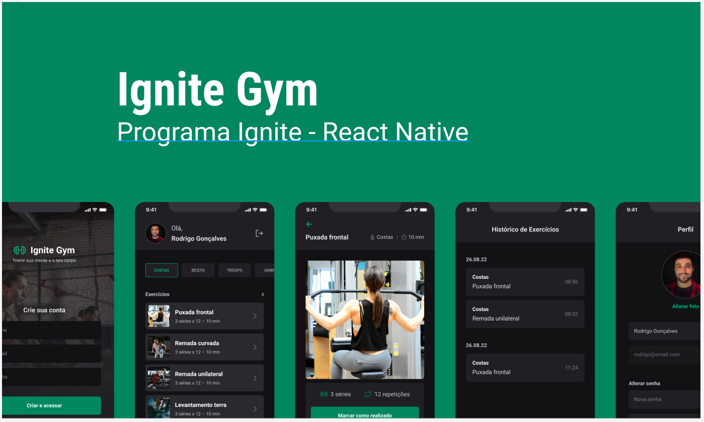
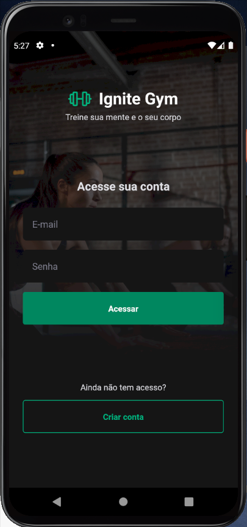
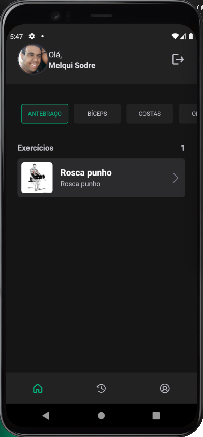

<!-- markdownlint-disable MD033 -->
<!-- markdownlint-disable MD041 -->

<div align="center">
   
   
   <a href="https://github.com/mgckaled/ignite-reactnative_ignitegym/commits/main">
      
   </a>
   
  
</div>

<br>

<div align="center">
  <a>
     
     
     
     

  <a/>
</div>

<br>

# React Native - Ignite Gym

<div align="center">

[**Sobre o Projeto**](#sobre-o-projeto) &nbsp;&nbsp;**•**&nbsp;&nbsp;
[**Layout**](#layout) &nbsp;&nbsp;**•**&nbsp;&nbsp;
[**Configurações**](#configurações) &nbsp;&nbsp;**•**&nbsp;&nbsp;
[**Tecnologias**](#tecnologias) &nbsp;&nbsp;**•**&nbsp;&nbsp;
[**Licença**](#licença)&nbsp;&nbsp;**•**&nbsp;&nbsp;
[**Autor**](#autor)

</div>


<br>


<br>


<br>

## Sobre o Projeto

A ideia dessa aplicação é termos um app onde podemos consultar exercícios de academia. Nesse aplicativo vamos ter dois tipos de navegações, uma navegação em pilha para as rotas publicas e uma navegação em abas, na parte inferior para as rotas privadas. Para estilizar essa aplicação utilizaremos o NativeBase, uma biblioteca de componentes estilizados para facilitar na criação do app.

## Layout

O layout das telas da aplicação **Ignite Gym** foi desenvolvido pela equipe da **Rocketseat** através da ferramenta [**Figma**](https://www.figma.com).
Você pode acessar o layout através deste link: [**Ignite Gym**](https://www.figma.com/file/ei00iY5OwDMXzDAYvwKs0V).

## Configurações

Necessário realizar as seguintes instalações:

- [Git](https://git-scm.com/)
- [npm](https://www.npmjs.com/)
- [Node](https://nodejs.org/)
- [Expo](https://docs.expo.dev/)
- [Expo Go](https://expo.dev/client) (Android ou IOS)

Criar conta e configurar os serviços externos:

- [GitHub](https://github.com/)
- [Expo](https://expo.dev/)

Clonar repositório:

```bash
# Execute o comando git clone para realizar o clone do repositório
$ git clone https://github.com/melquisedeque-magalhaes/ignite-gym
# ou execute
$ gh repo clone mgckaled/ignite-reactnative_ignitegym
# Entre na pasta do repositório clonado
$ cd ignite-reactnative_ignitegym
```

Dependências e inicialização:

```bash
## instalar dependências
$ npm i or yarn
# inicializar expo
$ npx expo start
```

Configurações Expo:

```bash
# após criar uma conta no Expo, faça login pelo terminal:
$ npx expo login
# confirme seu nome e senha
# confirmar login. O terminal deverá mostrar o nome do usuário
$ npx expo whoami
```

Scripts Backend:

```bash
# Rodar API em ambiente de desenvolvimento:
$ npm run dev or yarn dev 
# Rodar API em ambiente de procução:
$ npm start or yarn start
# Criar banco de dados
$ npm run migrate or yarn migrate
# Inserir dados no banco de dados:
$ npm run seed or yarn seed
```

Para visualizar a documentação da API, acesse [http://localhost:3333/api-docs](http://localhost:3333/api-docs) em ambiente de desenvolvimento.

## Tecnologias

- [React Native](https://reactnative.dev/)
- [TypeScript](https://www.typescriptlang.org/)
- [Expo](https://expo.dev/)
- [NativeBase](https://nativebase.io/)
- [React Native](https://reactnative.dev/)
- [Axios](https://axios-http.com/ptbr/docs/intro)
- [Yup](https://www.npmjs.com/package/yup)
- [React Hook Form](https://react-hook-form.com/)
- [React Native SVG](https://github.com/software-mansion/react-native-svg)
- [React Native SVG Transformer](https://www.npmjs.com/package/react-native-svg-transformer?activeTab)
- [Expo Image Picker](https://docs.expo.dev/versions/latest/sdk/imagepicker/)
- [React Native Safe Area Context](https://github.com/th3rdwave/react-native-safe-area-context)
- [React Navigation](https://reactnavigation.org/)
- [React Navigation - Stack Navigator](https://reactnavigation.org/docs/native-stack-navigator/)
- [React Navigation - Bottom Tabs Navigator](https://reactnavigation.org/docs/bottom-tab-navigator/)
- [Async Storage](https://react-native-async-storage.github.io/async-storage/)
- [Babel Plugin Inline Dotenv](https://www.npmjs.com/package/babel-plugin-inline-dotenv)
- [Babel Plugin Module Resolver](https://www.npmjs.com/package/babel-plugin-module-resolver)

## Licença

Distribuído sob a licença **_MIT_**. Veja [LICENSE](LICENSE) para mais informações.

## Suporte


<a href="https://www.buymeacoffee.com/melqui" target="_blank">
  
</a>

---

<p align="center">With 💜, by Melqui Sodré.</p>
